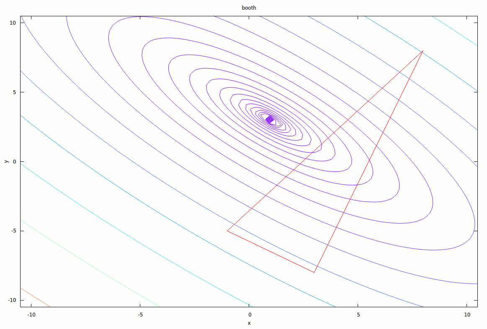
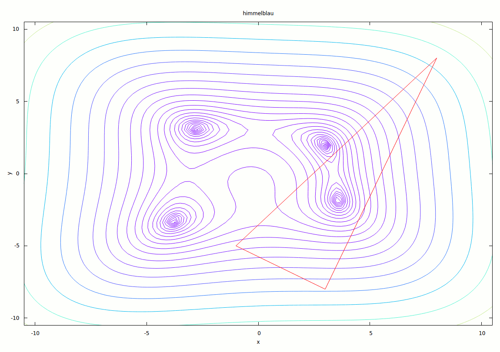

# Einführung

# Beispiele




# Implementation

### Klassenübersicht

#### Instanzvariablen

| Variablenname   | Beschreibung                     |
| --------------- | -------------------------------- |
| `Funktion& f`   | zu optimierendes Funktionsobjekt |
| `point b`       | bester Simplexpunkt              |
| `point g`       | mittlerer Simplexpunkt           |
| `point w`       | schlechtester Simplexpunkt       |
| `double eps`    | Epsilon (Kovergenzkriterium)     |
| `double alpha_` | Reflexionsfaktor                 |
| `double gamma_` | Expansionsfaktor                 |
| `double beta_`  | Kontraktionsfaktor               |
| `double delta_` | Komprimierungsfaktor             |
| `bool done`     | Zustandsvariable                 |
| `size_t iter_c` | Iterationszähler                 |

#### Methoden

| Methode                                               | Beschreibung                                                                   |
| ------------------------------------------------------| ------------------------------------------------------------------------------ |
| `- point& min(point&, point&)`                        | returniert den kleineren (per Funktionswert) der beiden Punkte                 |
| `- point& min(point&, point&, point&)`                | returniert den kleinsten (per Funktionswert) der drei Punkte                   |
| `- void sort_points_by_fvalue()`                      | sortiert die drei Werte B, G, W sodass `f(B) <= f(G) <= f(W)`                  |
| `- void do_step()`                                    | führt einen Optimierungsschritt aus                                            |
| `+ double alpha()`                                    | returniert Reflexionsfaktor                                                    |
| `+ double gamma()`                                    | returniert Expansionsfaktor                                                    |
| `+ double beta()`                                     | returniert Kontraktionsfaktor                                                  |
| `+ double delta()`                                    | returniert Komprimierungsfaktor                                                |
| `+ void set_alpha(double)`                            | setzt Reflexionsfaktor wenn möglich, wirft sonst `invalid_value`               |
| `+ void set_gamma(double)`                            | setzt Expansionsfaktor wenn möglich, wirft sonst `invalid_value`               |
| `+ void set_beta(double)`                             | setzt Kontraktionsfaktor wenn möglich, wirft sonst `invalid_value`             |
| `+ void set_delta(double)`                            | setzt Komprimierungsfaktor wenn möglich, wirft sonst `invalid_value`           |
| `+ point best_point()`                                | returniert besten Simplexpunkt                                                 |
| `+ std::tuple<point, point, point> current_simplex()` | returniert Tupel aller drei Simplexpunkte                                      |
| `+ bool done()`                                       | returniert Zustandsvariable                                                    |
| `+ size_t iteration_count()`                          | returniert den Wert des Iterationenzählers                                     |
| `+ void step()`                                       | führt Optimierungsschritt aus, sortiert Punkte und setzt ggf. Zustandsvariable |
| `+ optimize()`                                        | führt die Optimierung die komplette Optimierung durch                          |

### Algorithmus selbst

Die Implementierung umfasst eine Optimiererklasse `nelder_mead_optimizer`, der bei
der Instanziierung diverse Parameter übergeben werden müssen:

* Eine von der Klasse `Funktion` abgeleitete Funktionsrepräsentation, die die
  Methode `value(double, double)` bzw. `operator()(double, double)` implementiert
  haben muss
* 3 Startpunkte `p1`, `p2`, `p3` der Form (x, y), die den Startsimplex konstruieren
* Ein Double-Wert `eps`, der den zu verwendenden Epsilon-Wert angibt [optional,
  defaultmäßig .00001]
* Ein Double-Wert für den Reflexionsfaktor `alpha` [optional, defaultmäßig 1]
* Ein Double-Wert für den Expansionsfaktor `gamma` [optional, defaultmäßig 2]
* Ein Double-Wert für den Kontraktionsfaktor `beta` [optional, defaultmäßig .5]
* Ein Double-Wert für den Komprimierungsfaktor `delta` [optional, defaultmäßig .5]

Alle optionalen Werte können nachträglich mit dem entsprechenden Getter und
Setter abgefragt und geändert werden. Die Setter für die Verhaltensfaktoren
`alpha`, `beta`, `gamma` und `delta` prüfen die Sinnhaftigkeit der übergebenen
Werte und werfen eine Exception des Typs `invalid_value` mit einer
Fehlermeldung sollten diese nicht stimmen.

Ein Minimalbeispiel zum Rauskopieren (unter src/nmo/simple.cpp zu finden):

```c++
#include <iostream>
#include "nelder_mead_optimizer.hpp"

int main() {
    struct : Funktion {
        double value(double x, double y) { return x*x + y*y; }
    } fn;

    nelder_mead_optimizer nmo(fn, {-1, -5}, {8, 8}, {3, -8}, .0000001);
    nmo.optimize();
    point min = nmo.best_point();

    std::cout << "The minimum is at " << min.format() << "!\nNeeded "
              << nmo.iteration_count() << " iterations.\n";
}
```

Vorhergehendes Beispiel instanziiert ein Optimiererobjekt `nmo`, das die
Funktion `fn` optimieren soll, mit den Startpunkten (-1, -5), (8, 8) und (3,
-8). Das Epsilon für die Abbruchbedingung wurde als .0005 gewählt. Danach wird
die `optimize`-Methode aufgerufen, die die Optimierung bis zum Erreichen des
Konvergenzkriteriums durchführt. Anschließend kann der beste Punkt mittels
`get_best_point()` abgerufen werden. Die `point`-Klasse liegt der
Implementierung bei und umfasst die wichtigsten Vektor-Operationen sowie einen
extrem coolen Initialisiererlisten-Konstruktor, der die kurze Anschreibweise im
Konstruktoraufruf ermöglicht. Weiters wichtig sind die `format`- und
`raw`-Methoden, die den Inhalt des Punktes jeweils in einen String gießen.
`format()` ist zur schönen Ausgabe gedacht und `raw()` als Zwischenmedium zur
Weitergabe des Punktes an externe Programme (wie etwa gnuplot).

Um den Algorithmus möglichst flexibel benutzen zu können, kann auch die Methode
`step` verwendet werden, um den Algorithmus schrittweise verfolgen zu können.
Auskunft über den Zustand gibt die `done` Methode. Folgendes Beispiel optimiert
eine Funktion wie das vorige, gibt bei jedem Schritt jedoch auch den
derzeitigen Simplex aus.

```c++
nelder_mead_optimizer nmo(fn, {-1, -5}, {8, 8}, {3, -8}, .0005);

while(!nmo.done()) {
    std::cout << "\nIteration #" << nmo.iteration_count() << '\n';
    auto points = nmo.current_simplex();

    std::cout << "B = " << std::get<0>(points).format() << '\n'
              << "G = " << std::get<1>(points).format() << '\n'
              << "W = " << std::get<2>(points).format() << '\n';

    nmo.step();
}
```

### Testprogramm

Das Testprogramm benötigt POSIX-Pipes (i.e. ist nur auf Linux und ggf. auch OS
X lauffähig) und gnuplot zum darstellen des Optimierungsverlaufes. Folgende
Funktionen sind vorimplementiert:

* Himmelblau-Funktion (Befehl: `himmelblau`)
* Rosenbrocks Bananen-Funktion (Befehl: `banana`)
* Matyas-Funktion (Befehl: `matyas`)
* Dreihöcker-Kamelfunktion (Befehl: `camel`)
* Booth-Funktion (Befehl: `booth`)
* Beale-Funktion (Befehl: `beale`)
* Beispielfunktion 1, `3*x**2 + y**2 - 3*x*y - 3*x` (Befehl: `example1`)
* Beispielfunktion 2, `y**4 + 2*x**2 - 3*x*y + 1` (Befehl: `example2`)
* Beispielfunktion 3, `3*x**2 + y + y**2` (Befehl: `example3`)

Ein Aufruf sieht folgendermaßen aus: `./nelder_mead [FUNKTIONSNAME]`. Per
default schläft das Programm zwischen Iterationsschritten, um das betrachten
der Ausgabegraphen zu ermöglichen. Ist dies nicht genug, kann via
`./nelder_mead [FUNKTIONSNAME] manual` erwirkt werden, dass auf eine beliebige
Usereingabe gewartet wird.

Weiters ist eine kleine Informationsfunktion eingebaut. Mittels `./nelder_mead
info [FUNKTIONSNAME]` kann diese aufgerufen werden und liefert dann
beispielsweise solche Ausgaben:

```
$ ./nelder_mead info himmelblau

H I M M E L B L A U  function
The Himmelblau function is commonly used for benchmarking optimization
algorithms. It is defined as
                    2          2         2     2
        f(x, y) = (x  + y - 11)  + (x + y  - 7)

Its minima are at positions
    f(3.2, 2.0) = 0.0
    f(-2.805118, 3.131312) = 0.0
    f(-3.779310, -3.283186) = 0.0
    f(3.584428, -1.848126) = 0.0
```
Es werden zumindest die Funktionsdefinition sowie die Minima ausgegeben.

Werden dem Programm keine Argumente übergeben, beschwert es sich
dementsprechend und zeigt eine kleine Hilfe mit den unterstützten
Funktionalitäten an. Überschüssige Argumente werden ignoriert.

### Links

[Files auf GitHub (garantiert aktuell)](https://github.com/burnoutberni/univie-ops/tree/master/src/nelder_mead)

[nelder_mead.zip](https://github.com/burnoutberni/univie-ops/blob/master/src/nelder_mead.zip?raw=true)
